## Задание 1. Знакомимся с GitLab и Bitbucket 

Из-за сложности доступа к Bitbucket в работе достаточно использовать два репозитория: GitHub и GitLab.

Иногда при работе с Git-репозиториями надо настроить свой локальный репозиторий так, чтобы можно было 
отправлять и принимать изменения из нескольких удалённых репозиториев. 

Это может понадобиться при работе над проектом с открытым исходным кодом, если автор проекта не даёт права на запись в основной репозиторий.

Также некоторые распределённые команды используют такой принцип работы, когда каждый разработчик имеет свой репозиторий, а в основной репозиторий пушатся только конечные результаты 
работы над задачами. 

### GitLab

Создадим аккаунт в GitLab, если у вас его ещё нет:

1. GitLab. Для [регистрации](https://gitlab.com/users/sign_up)  можно использовать аккаунт Google, GitHub и другие. 
1. После регистрации или авторизации в GitLab создайте новый проект, нажав на ссылку `Create a projet`. 
Желательно назвать также, как и в GitHub — `devops-netology` и `visibility level`, выбрать `Public`.
1. Галочку `Initialize repository with a README` лучше не ставить, чтобы не пришлось разрешать конфликты.
1. Если вы зарегистрировались при помощи аккаунта в другой системе и не указали пароль, то увидите сообщение:
`You won't be able to pull or push project code via HTTPS until you set a password on your account`. 
Тогда перейдите [по ссылке](https://gitlab.com/profile/password/edit) из этого сообщения и задайте пароль. 
Если вы уже умеете пользоваться SSH-ключами, то воспользуйтесь этой возможностью (подробнее про SSH мы поговорим в следующем учебном блоке).
1. Перейдите на страницу созданного вами репозитория, URL будет примерно такой:
https://gitlab.com/YOUR_LOGIN/devops-netology. Изучите предлагаемые варианты для начала работы в репозитории в секции
`Command line instructions`. 
1. Запомните вывод команды `git remote -v`.
1. Из-за того, что это будет наш дополнительный репозиторий, ни один вариант из перечисленных в инструкции (на странице 
вновь созданного репозитория) нам не подходит. Поэтому добавляем этот репозиторий, как дополнительный `remote`, к созданному
репозиторию в рамках предыдущего домашнего задания:
`git remote add gitlab https://gitlab.com/YOUR_LOGIN/devops-netology.git`.
1. Отправьте изменения в новый удалённый репозиторий `git push -u gitlab main`.
1. Обратите внимание, как изменился результат работы команды `git remote -v`.

#### Как изменить видимость репозитория в  GitLab — сделать его публичным 

* На верхней панели выберите «Меню» -> «Проекты» и найдите свой проект.
* На левой боковой панели выберите «Настройки» -> «Основные».
* Разверните раздел «Видимость» -> «Функции проекта» -> «Разрешения».
* Измените видимость проекта на Public.
* Нажмите «Сохранить изменения».

### Bitbucket* (задание со звёздочкой) 

Это самостоятельное задание, его выполнение необязательно.
____

Теперь необходимо проделать всё то же самое с [Bitbucket](https://bitbucket.org/). 

1. Обратите внимание, что репозиторий должен быть публичным — отключите галочку `private repository` при создании репозитория.
1. На вопрос `Include a README?` отвечайте отказом. 
1. В отличии от GitHub и GitLab в Bitbucket репозиторий должен принадлежать проекту, поэтому во время создания репозитория 
надо создать и проект, который можно назвать, например, `netology`.
1. Аналогично GitLab на странице вновь созданного проекта выберите `https`, чтобы получить ссылку, и добавьте этот репозиторий, как 
`git remote add bitbucket ...`.
1. Обратите внимание, как изменился результат работы команды `git remote -v`.

Если всё проделано правильно, то результат команды `git remote -v` должен быть следующий:

```bash
$ git remote -v
bitbucket https://andreyborue@bitbucket.org/andreyborue/devops-netology.git (fetch)
bitbucket https://andreyborue@bitbucket.org/andreyborue/devops-netology.git (push)
gitlab	  https://gitlab.com/andrey.borue/devops-netology.git (fetch)
gitlab	  https://gitlab.com/andrey.borue/devops-netology.git (push)
origin	  https://github.com/andrey-borue/devops-netology.git (fetch)
origin	  https://github.com/andrey-borue/devops-netology.git (push)
```

Дополнительно можете добавить удалённые репозитории по `ssh`, тогда результат будет примерно такой:

```bash
git remote -v
bitbucket	git@bitbucket.org:andreyborue/devops-netology.git (fetch)
bitbucket	git@bitbucket.org:andreyborue/devops-netology.git (push)
bitbucket-https	https://andreyborue@bitbucket.org/andreyborue/devops-netology.git (fetch)
bitbucket-https	https://andreyborue@bitbucket.org/andreyborue/devops-netology.git (push)
gitlab	git@gitlab.com:andrey.borue/devops-netology.git (fetch)
gitlab	git@gitlab.com:andrey.borue/devops-netology.git (push)
gitlab-https	https://gitlab.com/andrey.borue/devops-netology.git (fetch)
gitlab-https	https://gitlab.com/andrey.borue/devops-netology.git (push)
origin	git@github.com:andrey-borue/devops-netology.git (fetch)
origin	git@github.com:andrey-borue/devops-netology.git (push)
origin-https	https://github.com/andrey-borue/devops-netology.git (fetch)
origin-https	https://github.com/andrey-borue/devops-netology.git (push)
```

Выполните push локальной ветки `main` в новые репозитории. 

Подсказка: `git push -u gitlab main`. На этом этапе история коммитов во всех трёх репозиториях должна совпадать.   

### Решение:  
- Зарегистрируемся на gitlab и bitbucket, создадим там пустые репозитории,добавим репозитории https при помощи 
git remote add и запушим в ветку main все изменения, которые были сделаны в origin-репозитории на github.

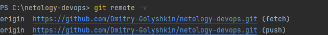

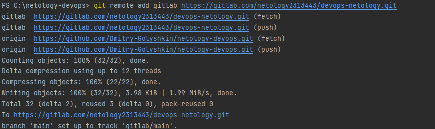

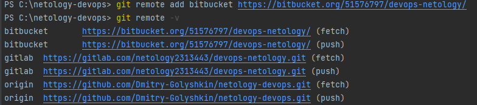

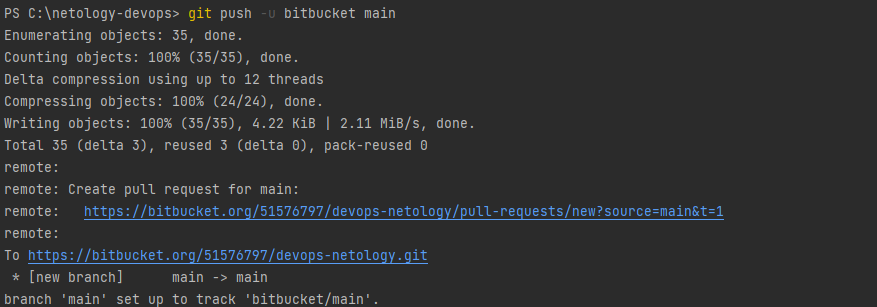

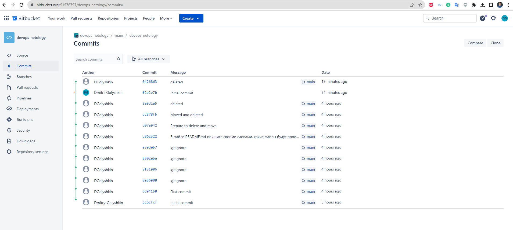

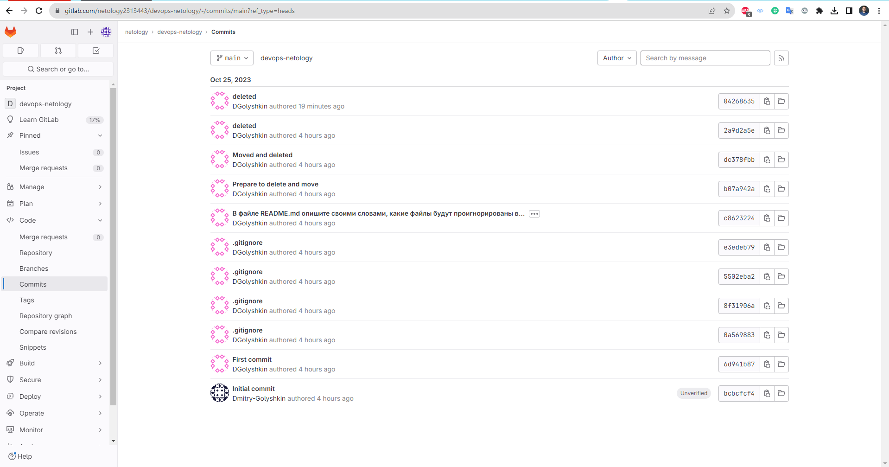

## Задание 2. Теги

Представьте ситуацию, когда в коде была обнаружена ошибка — надо вернуться на предыдущую версию кода,
исправить её и выложить исправленный код в продакшн. Мы никуда не будем выкладывать код, но пометим некоторые коммиты тегами и создадим от них ветки. 

1. Создайте легковестный тег `v0.0` на HEAD-коммите и запуште его во все три добавленных на предыдущем этапе `upstream`.
1. Аналогично создайте аннотированный тег `v0.1`.
1. Перейдите на страницу просмотра тегов в GitHab (и в других репозиториях) и посмотрите, чем отличаются созданные теги. 
    * в GitHub — https://github.com/YOUR_ACCOUNT/devops-netology/releases;
    * в GitLab — https://gitlab.com/YOUR_ACCOUNT/devops-netology/-/tags;
    * в Bitbucket — список тегов расположен в выпадающем меню веток на отдельной вкладке.

### Решение:
- Создадим tag v0.1 во все системы контроля версий.    

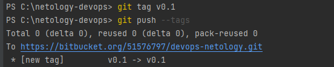

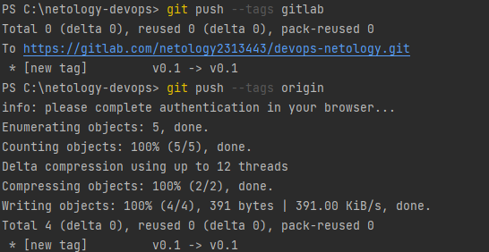

- Создадим annotated tag и запушим его по аналогии с tag v0.1:
```
PS C:\netology-devops> git tag -a v0.2 -m "This is a test annother commit"
PS C:\netology-devops> git show v0.2
tag v0.2
Tagger: DGolyshkin <eremarambler@list.ru>
Date:   Wed Oct 25 22:36:43 2023 +0300
```
- Проверяем

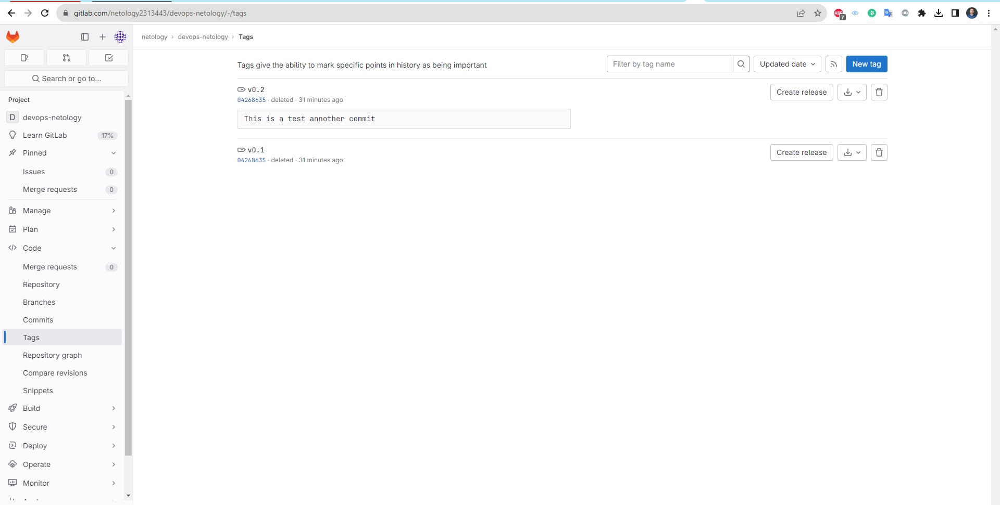

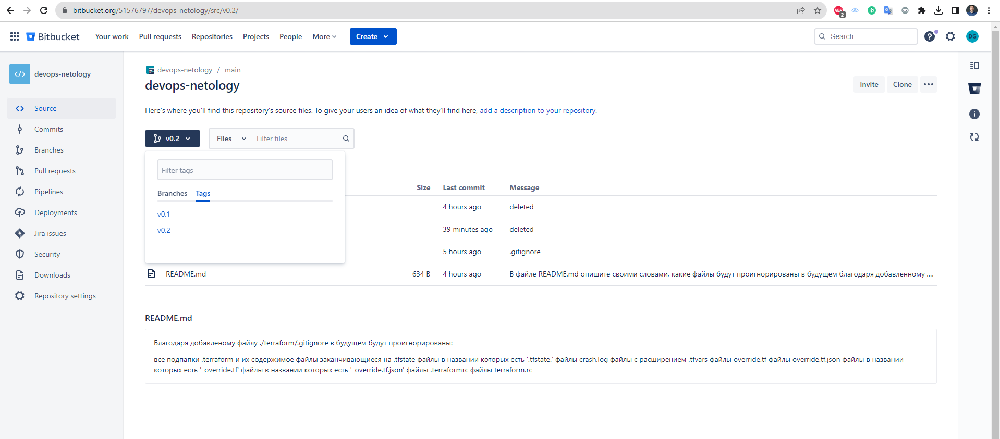

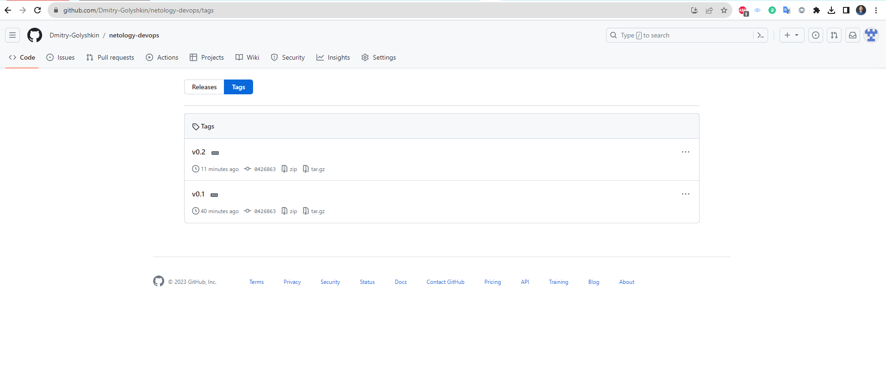

## Задание 3. Ветки 

Давайте посмотрим, как будет выглядеть история коммитов при создании веток.

1. Переключитесь обратно на ветку main, которая должна быть связана с веткой main репозитория на github.
2. Посмотрите лог коммитов и найдите хеш коммита с названием Prepare to delete and move, который был создан в пределах предыдущего домашнего задания.
3. Выполните git checkout по хешу найденного коммита.
4. Создайте новую ветку fix, базируясь на этом коммите git switch -c fix.
5. Отправьте новую ветку в репозиторий на GitHub git push -u origin fix.
6. Посмотрите, как визуально выглядит ваша схема коммитов: https://github.com/YOUR_ACCOUNT/devops-netology/network.
7. Теперь измените содержание файла README.md, добавив новую строчку.
8. Отправьте изменения в репозиторий и посмотрите, как изменится схема на странице https://github.com/YOUR_ACCOUNT/devops-netology/network и как изменится вывод команды git log.

### Решение:
### Github
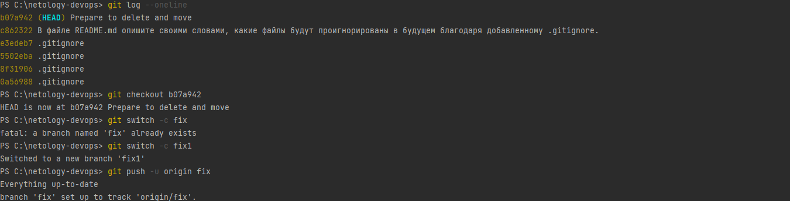
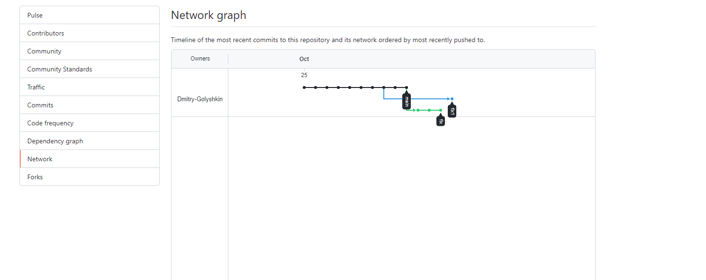

### Gitlab
```PS C:\netology-devops> git checkout gitlab/main
HEAD is now at c9e71cd Merge branch 'main' into fix1
PS C:\netology-devops> git log --online
fatal: unrecognized argument: --online
PS C:\netology-devops> git log --oneline
45dfd88 02-git-02-base
22f1e84 02-git-02-base
61da88d 02-git-02-base
0426863 (tag: v0.2, tag: v0.1, bitbucket/main) deleted
2a9d2a5 deleted
dc378fb Moved and deleted
b07a942 Prepare to delete and move
c862322 В файле README.md опишите своими словами, какие файлы будут проигнорированы в будущем благодаря добавленному .gitignore.
e3edeb7 .gitignore
PS C:\netology-devops> git checkout b07a942
HEAD is now at b07a942 Prepare to delete and move
PS C:\netology-devops> git switch -c fix
PS C:\netology-devops> git push -u origin fix
To https://github.com/Dmitry-Golyshkin/netology-devops.git
 ! [rejected]        fix -> fix (non-fast-forward)
error: failed to push some refs to 'https://github.com/Dmitry-Golyshkin/netology-devops.git'
hint: Updates were rejected because the tip of your current branch is behind
hint: its remote counterpart. Integrate the remote changes (e.g.
hint: 'git pull ...') before pushing again.
hint: See the 'Note about fast-forwards' in 'git push --help' for details.
PS C:\netology-devops> git branch
* fix
  main
PS C:\netology-devops> git pull origin fix
From https://github.com/Dmitry-Golyshkin/netology-devops
 * branch            fix        -> FETCH_HEAD
Updating b07a942..e848bf0
Fast-forward
 .../{will_be_moved.txt => has_been_moved.txt}      |   0
 02-git-01-vcs/will_be_deleted.txt                  |   1 -
 02-git-02-base/README.md                           | 162 +++++++++++++++++++++
 02-git-02-base/img.png                             | Bin 0 -> 13250 bytes
 02-git-02-base/img_1.png                           | Bin 0 -> 50649 bytes
 02-git-02-base/img_10.png                          | Bin 0 -> 41795 bytes
 02-git-02-base/img_2.png                           | Bin 0 -> 41304 bytes
 02-git-02-base/img_3.png                           | Bin 0 -> 42121 bytes
 02-git-02-base/img_4.png                           | Bin 0 -> 82620 bytes
 02-git-02-base/img_5.png                           | Bin 0 -> 172669 bytes
 02-git-02-base/img_6.png                           | Bin 0 -> 15513 bytes
 02-git-02-base/img_7.png                           | Bin 0 -> 38691 bytes
 02-git-02-base/img_8.png                           | Bin 0 -> 95431 bytes
 02-git-02-base/img_9.png                           | Bin 0 -> 83267 bytes
 14 files changed, 162 insertions(+), 1 deletion(-)
 rename 02-git-01-vcs/{will_be_moved.txt => has_been_moved.txt} (100%)
 delete mode 100644 02-git-01-vcs/will_be_deleted.txt
 create mode 100644 02-git-02-base/img.png
 create mode 100644 02-git-02-base/img_1.png
 create mode 100644 02-git-02-base/img_10.png
 create mode 100644 02-git-02-base/img_2.png
 create mode 100644 02-git-02-base/img_3.png
 create mode 100644 02-git-02-base/img_4.png
 create mode 100644 02-git-02-base/img_5.png
 create mode 100644 02-git-02-base/img_6.png
 create mode 100644 02-git-02-base/img_7.png
 create mode 100644 02-git-02-base/img_8.png
PS C:\netology-devops> git pull
There is no tracking information for the current branch.
Please specify which branch you want to merge with.
See git-pull(1) for details.

    git pull <remote> <branch>

Already up to date.
PS C:\netology-devops> git push -u origin fix
Enumerating objects: 10, done.
Counting objects: 100% (10/10), done.
Delta compression using up to 12 threads
Compressing objects: 100% (4/4), done.
Writing objects: 100% (4/4), 781 bytes | 781.00 KiB/s, done.
Total 4 (delta 3), reused 0 (delta 0), pack-reused 0
remote: Resolving deltas: 100% (3/3), completed with 3 local objects.
To https://github.com/Dmitry-Golyshkin/netology-devops.git
   e848bf0..4c2498e  fix -> fix
branch 'fix' set up to track 'origin/fix'.
PS C:\netology-devops>

```
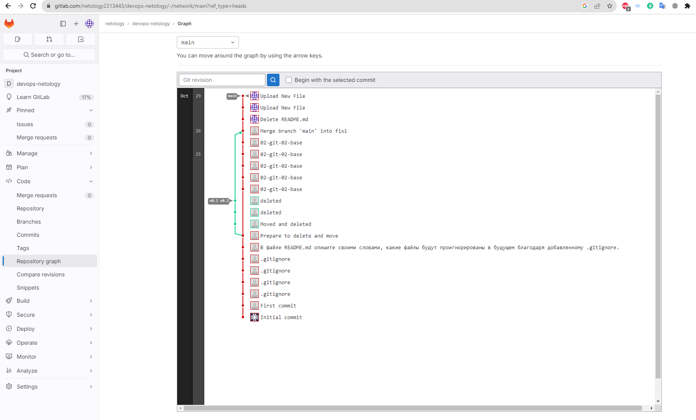
### BitBucket
```angular2html
PS C:\netology-devops> git checkout dc378fb
        02-git-02-base/README.md
Please commit your changes or stash them before you switch branches.
Aborting
PS C:\netology-devops> git switch -c fix1
PS C:\netology-devops> git log --oneline      
c9e71cd (origin/main, origin/HEAD, gitlab/main, main) Merge branch 'main' into fix1
45dfd88 02-git-02-base
22f1e84 02-git-02-base
15bf26e 02-git-02-base
61da88d 02-git-02-base
40b036f 02-git-02-base
e848bf0 02-git-02-base
PS C:\netology-devops> git branch -a
* fix1
  main
  remotes/bitbucket/main
  remotes/gitlab/main
  remotes/origin/HEAD -> origin/main
  remotes/origin/fix1
PS C:\netology-devops> git remote -v
bitbucket       https://dagolyshkin@bitbucket.org/51576797/devops-netology.git (fetch)
bitbucket       https://dagolyshkin@bitbucket.org/51576797/devops-netology.git (push)
gitlab  https://gitlab.com/netology2313443/devops-netology.git (fetch)
gitlab  https://gitlab.com/netology2313443/devops-netology.git (push)
origin  https://github.com/Dmitry-Golyshkin/netology-devops.git (fetch)
origin  https://github.com/Dmitry-Golyshkin/netology-devops.git (push)
PS C:\netology-devops> git push -u bitbucket fix1         
Enumerating objects: 53, done.
Counting objects: 100% (52/52), done.
Delta compression using up to 12 threads
Compressing objects: 100% (46/46), done.
Writing objects: 100% (47/47), 803.84 KiB | 34.95 MiB/s, done.
Total 47 (delta 17), reused 0 (delta 0), pack-reused 0
remote: 
remote: Create pull request for fix1:
remote:   https://bitbucket.org/51576797/devops-netology/pull-requests/new?source=fix1&t=1
remote:
To https://bitbucket.org/51576797/devops-netology.git
 * [new branch]      fix1 -> fix1
branch 'fix1' set up to track 'bitbucket/fix1'.

```
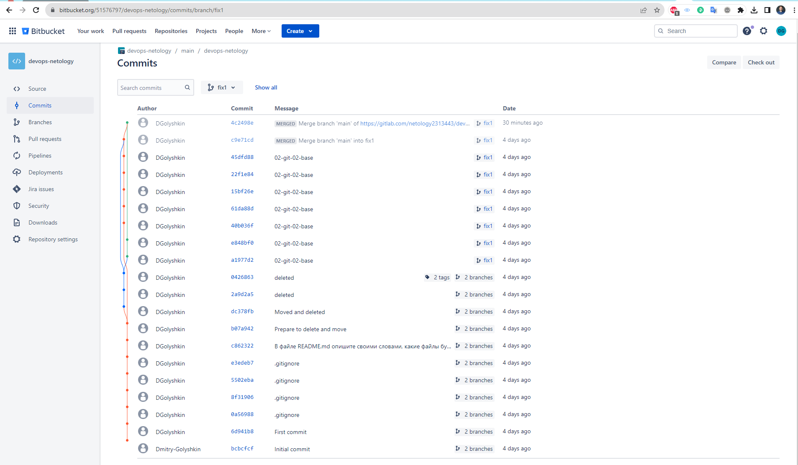

## Задание 4. Упрощаем себе жизнь

Попробуем поработь с Git при помощи визуального редактора. 

1. В используемой IDE PyCharm откройте визуальный редактор работы с Git, находящийся в меню View -> Tool Windows -> Git.
1. Измените какой-нибудь файл, и он сразу появится на вкладке `Local Changes`, отсюда можно выполнить коммит, нажав на кнопку внизу этого диалога. 
1. Элементы управления для работы с Git будут выглядеть примерно так:

  
   
1. Попробуйте выполнить пару коммитов, используя IDE. 

[По ссылке](https://www.jetbrains.com/help/pycharm/commit-and-push-changes.html) можно найти справочную информацию по визуальному интерфейсу. 

Если вверху экрана выбрать свою операционную систему, можно посмотреть горячие клавиши для работы с Git. 
Подробней о визуальном интерфейсе мы расскажем на одной из следующих лекций.

*В качестве результата работы по всем заданиям приложите ссылки на ваши репозитории в GitHub, GitLab и Bitbucket*.    

### Решение:  
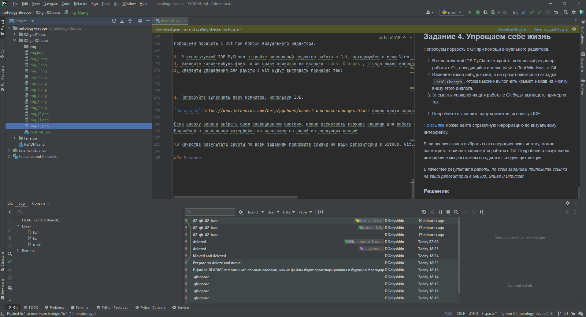  
